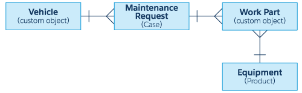

# 🏆[Apex Specialist](https://trailhead.salesforce.com/en/content/learn/superbadges/superbadge_apex)

## 如何赚取此超级徽章

1. 使用Apex触发器自动创建记录(`Apex triggers`)
2. 使用异步REST标注将Salesforce数据与外部系统同步(`REST callouts`)
3. 使用Apex代码安排同步(`Schedule synchronization`)
4. 测试自动化逻辑以确认Apex触发副作用(`Test automation logic`)
5. 使用标注模拟测试集成逻辑(`Test integration logic`)
6. 测试调度逻辑以确认操作已排队(`Test scheduling logic`)

## 实体图



## 1️⃣Step1 **Automate record creation**

```java
trigger MaintenanceRequest on Case (before update, after update) {
    // ToDo: Call MaintenanceRequestHelper.updateWorkOrders
    if(Trigger.isAfter && Trigger.isUpdate){
        MaintenanceRequestHelper.updateWorkOrders();
    }
}
```

```java
public class MaintenanceRequestHelper { 
    public static void updateWorkOrders(){
        // update workorders
        List<Case> insertCaseLst = new List<Case>();
        List<Case> csList =  [select id,Vehicle__r.Id,Equipment__r.Id,(select id from Work_Parts__r) 
                              from case 
                              where status = 'Closed' 
                              and Id IN :Trigger.new 
                              and Type in('Repair','Routine Maintenance')];
        System.debug('csList-->'+csList);
        for(Case cs:csList){
            List<Work_Part__c> workPartLst = cs.Work_Parts__r;
            Case newCase = new Case(Type = 'Routine Maintenance', 
                                    Subject = 'New Routine Maintenance',
                                    Date_Reported__c = System.Today(), 
                                    Date_Due__c = System.Today() + calculateDueDate(workPartLst),
                                    Vehicle__c = cs.Vehicle__r.Id,Origin='Web',
                                    Status='New',
                                    Equipment__c = cs.Equipment__r.Id);
            insertCaseLst.add(newCase);
            
        }
        if(insertCaseLst!=null && insertCaseLst.size()>0){
            insert insertCaseLst;
        } 
    }  
    
    public static Integer calculateDueDate(List<Work_Part__c> workPartLst){
        Integer count = 0;
        List<AggregateResult> agrResult = [select min(Equipment__r.Maintenance_Cycle__c) arg 
                                           from Work_Part__c 
                                           where id in:workPartLst ];
        for(AggregateResult ar : agrResult){
            count = (Integer) ar.get('arg');
        }
        return count !=null ? count : 0 ;
    }      
    
}
```

## 2️⃣Step2 **Synchronize Salesforce data with an external system**

```java
public with sharing class WarehouseCalloutService {
    
    private static final String WAREHOUSE_URL = 'https://th-superbadge-apex.herokuapp.com/equipment';
    
    @future(callout=true)
    public static void runWarehouseEquipmentSync() {
        //ToDo: complete this method to make the callout (using @future) to the
        //      REST endpoint and update equipment on hand.
        Http http = new Http();
        HttpRequest request = new HttpRequest();
        request.setEndpoint(WAREHOUSE_URL);
        request.setMethod('GET');
        HttpResponse response = http.send(request);
        // If the request is successful, parse the JSON response.
        if (response.getStatusCode() == 200) {
            // Deserialize the JSON string into collections of primitive data types.
            List<Object> equipments = (List<Object>) JSON.deserializeUntyped(response.getBody());
            List<Product2> products = new List<Product2>();
            for(Object o :  equipments){
                Map<String, Object> mapProduct = (Map<String, Object>)o;
                Product2 product = new Product2();
                product.Name = (String)mapProduct.get('name');
                product.Cost__c = (Integer)mapProduct.get('cost');
                product.Current_Inventory__c = (Integer)mapProduct.get('quantity');
                product.Maintenance_Cycle__c = (Integer)mapProduct.get('maintenanceperiod');
                product.Replacement_Part__c = (Boolean)mapProduct.get('replacement');
                product.Lifespan_Months__c = (Integer)mapProduct.get('lifespan');
                product.Warehouse_SKU__c = (String)mapProduct.get('sku');
                product.ProductCode = (String)mapProduct.get('_id');
                products.add(product);
            }
            if(products.size() > 0){
                System.debug(products);
                upsert products;
            }
        }
    }
}
```

